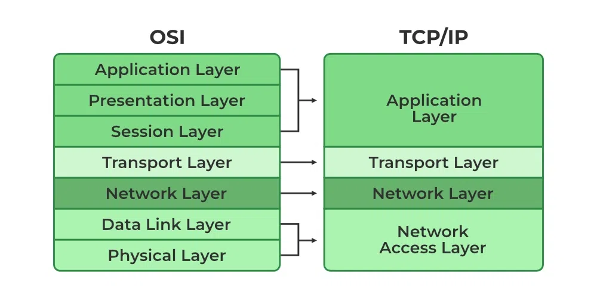

# 03 - Networking Refresher

---

## OSI Model vs TCP/IP Model

Both models explain how data moves through a network in layers, but OSI is a **theoretical model**, while TCP/IP is the **practical implementation** used in real-world networks.

### OSI Model (7 Layers – Conceptual)

1. **Application** – Interface for end users (HTTP, FTP, SMTP)
2. **Presentation** – Data formatting, encryption, compression
3. **Session** – Manages connections (start, maintain, end)
4. **Transport** – Reliable data transfer (TCP/UDP, segmentation)
5. **Network** – Routing & addressing (IP)
6. **Data Link** – Frame delivery (MAC address, switches)
7. **Physical** – Actual hardware transmission (cables, NICs)

> Think: **All People Seem To Need Data Processing**

### TCP/IP Model (4 Layers – Practical)

1. **Application** – Combines Application + Presentation + Session  
2. **Transport** – TCP, UDP  
3. **Internet** – IP, ICMP, routing  
4. **Network Access** – Ethernet, MAC, physical transmission

> TCP/IP is what’s actually used in real networks (Internet, LANs, etc.)

### Key Differences

| OSI Model            | TCP/IP Model         |
|----------------------|----------------------|
| 7 Layers             | 4 Layers             |
| Theoretical model    | Real-world standard  |
| Strict layer separation | Loosely defined layers |
| Developed by ISO     | Developed by DARPA (US DoD) |

---

## Common Ports

Ports identify services running on a system. Below are some important ones to remember:

| Port | Protocol | Service              |
|------|----------|----------------------|
| 20   | TCP      | FTP (Data)           |
| 21   | TCP      | FTP (Control)        |
| 22   | TCP      | SSH                  |
| 23   | TCP      | Telnet (insecure)    |
| 25   | TCP      | SMTP (email sending) |
| 53   | TCP/UDP  | DNS                  |
| 67   | UDP      | DHCP (server)        |
| 68   | UDP      | DHCP (client)        |
| 80   | TCP      | HTTP                 |
| 110  | TCP      | POP3 (email)         |
| 123  | UDP      | NTP (time sync)      |
| 143  | TCP      | IMAP (email)         |
| 443  | TCP      | HTTPS (secure web)   |
| 445  | TCP      | SMB (Windows sharing)|
| 3389 | TCP      | RDP (Remote Desktop) |

---

## Common Protocols

### TCP (Transmission Control Protocol)

- **Connection-oriented**, reliable, ordered delivery
- Used when data must arrive intact (e.g., websites, emails)
- Performs handshakes and retransmissions

### UDP (User Datagram Protocol)

- **Connectionless**, faster but unreliable
- Used for streaming, VoIP, gaming
- No guarantee of delivery or order

### IP (Internet Protocol)

- Handles addressing and routing
- IPv4: 32-bit (e.g., 192.168.1.1)  
- IPv6: 128-bit (e.g., 2001:0db8::1)

### DNS (Domain Name System)

- Resolves domain names to IP addresses (e.g., google.com → 142.250.192.14)

### DHCP (Dynamic Host Configuration Protocol)

- Automatically assigns IP addresses and network config to devices

### HTTP/HTTPS

- Web communication  
- HTTP = plaintext  
- HTTPS = encrypted via SSL/TLS

### ICMP (Internet Control Message Protocol)

- Used for diagnostic tools like `ping`, `traceroute`

References : `https://www.geeksforgeeks.org/open-systems-interconnection-model-osi/` , `https://www.geeksforgeeks.org/computer-networks/tcp-ip-model/`